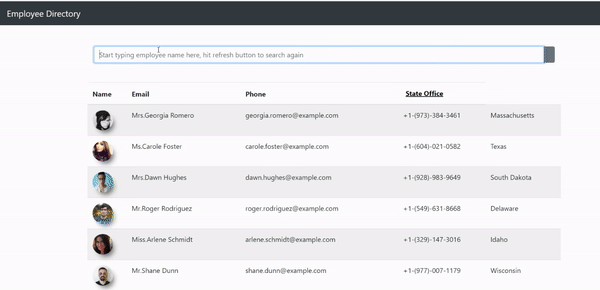

# Employee-Directory

An app used to get details such as email id , contact information of the employees.

## Usage 

[Random User API](https://randomuser.me/)
* React 
* npm
* bootstrap
* React router 

## Installation 
* Run `npm install` for dependencies
* Run `npm start` to start application 

